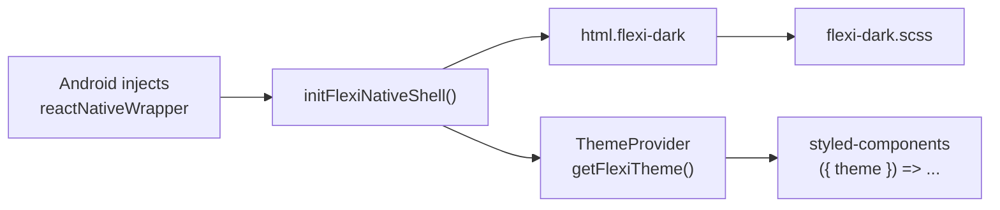
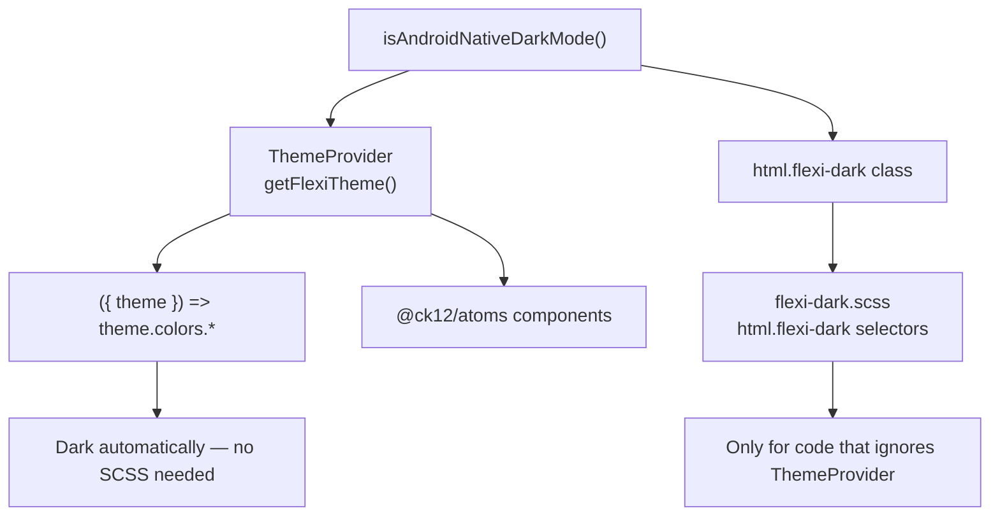

# Flexi Android WebView Dark Mode

## Goal

Dark mode in the **Android Flexi student app** when native injects:

```js
window.reactNativeWrapper = {
  theme: "dark",
  appInfo: { platform: "android", ... }
};
```

Users only visit `/flexi` — no URL params. Web, PWA, iOS, and light Android stay unchanged.

**When dark mode is on:** `theme === "dark"` **and** `platform === "android"`.

---

## How it works



| Layer | File | What it fixes |
|---|---|---|
| JS detection + palette | `flexiTheme.js` | Gate + dark color tokens |
| React theme context | `ChatbotGlobal.js` | Atoms + styled-components using `theme` |
| SCSS overrides | `flexi-dark.scss` | Hardcoded `#fff` in `.scss` files |
| Native layout | `flexi-dark.scss` + `index.html` | Full-screen, hide header |

---

## theme.colors vs flexi-dark.scss (important)

These are **two separate paths**. You do **not** override `theme.colors` in `flexi-dark.scss` — they are complementary, not redundant.



| Approach | When to use | Need `flexi-dark.scss`? |
|---|---|---|
| **`theme.colors`** | styled-components with `({ theme }) =>`, `@ck12/atoms` inside `ThemeProvider` | **No** |
| **`flexi-dark.scss`** | plain `.scss` with `#fff` / `white`, or JS still using `atomTheme` | **Yes** |

### If you use `theme.colors` — no SCSS override

`ChatbotGlobal` passes the dark palette via `getFlexiTheme()`. When Android dark mode is on, `theme.colors.white` is `#1A1A2E` (not `#FFFFFF`) — automatically, with no class-based override.

```js
// ✅ Dark mode works — do NOT add this to flexi-dark.scss
const Card = styled.div`
  background: ${({ theme }) => theme.colors.white};
  color: ${({ theme }) => theme.colors.darkText};
`;

<Input />  // atoms read theme internally — also automatic
```

### When you need `flexi-dark.scss`

Only when the color **does not** go through `ThemeProvider`:

| Case | Example | Fix |
|---|---|---|
| Plain `.scss` | `background: #ffffff` in `UserInput/style.scss` | `html.flexi-dark` override in `flexi-dark.scss` |
| Hardcoded hex in styled | `background: #ffffff` | Prefer migrate to `theme.colors.*` |
| `atomTheme` at module level | `` color: ${atomTheme.colors.darkText} `` | Migrate to `({ theme }) => theme.colors.darkText` |
| `atomTheme` in JSX props | `textColor={atomTheme.colors.darkText}` | Use `getFlexiTheme().colors.darkText` |

### Decision rule

```
Can this color use ({ theme }) => theme.colors.X  or  getFlexiTheme()?
  YES → use that — skip flexi-dark.scss
  NO  → add html.flexi-dark override in flexi-dark.scss (until migrated)
```

`flexi-dark.scss` is a **bridge for legacy hardcoded styles**, not a second copy of the theme palette. New code should use `theme.colors` so colors live in one place (`flexiTheme.js`).

### When `flexi-dark.scss` loads

Imported in `ChatbotGlobal.js` → bundled with the ChatbotGlobal chunk → injected when `/flexi` calls `ck12Chatbot.init()`.

- CSS is always loaded once Flexi boots.
- Dark rules only apply when `initFlexiNativeShell()` adds `html.flexi-dark` (Android + `theme: "dark"`).
- `html.flexi-native-app` rules apply when `window.reactNativeWrapper` exists (layout only).
- Light mode / web / iOS: file loads but selectors don't match → no visual change.

### Examples in repo today

| Code | How dark mode applies |
|---|---|
| `Text.jsx` — `({ theme }) => theme.colors.darkText` | ThemeProvider only |
| `UserInput/style.scss` — `#ffffff` | `flexi-dark.scss` override |
| `Card.jsx` — `atomTheme.colors.darkText` | Neither fully — migrate to `theme` or `getFlexiTheme()` |

---

## Files (v1 — 4 files)

| File | Action |
|---|---|
| `packages/ck12-chatbot/src/theme/flexiTheme.js` | Create |
| `packages/ck12-chatbot/src/containers/ChatbotGlobal/flexi-dark.scss` | Create |
| `packages/ck12-chatbot/src/containers/ChatbotGlobal/ChatbotGlobal.js` | Wire theme + scss |
| `packages/ck12-chatbot/public/index.html` | `activatedBy: "native_android"` when wrapper present |

---

## How to use

### 1. Wire once in ChatbotGlobal

```js
import { ThemeProvider } from "@ck12/atoms";
import { getFlexiTheme, initFlexiNativeShell } from "../../theme/flexiTheme";
import "./flexi-dark.scss";

initFlexiNativeShell();

<ThemeProvider theme={getFlexiTheme()}>
  {/* app */}
</ThemeProvider>
```

`initFlexiNativeShell()` adds `flexi-dark` / `flexi-native-app` on `<html>` and sets `theme-color`.

### 2. Styled-components — use `theme` from context (preferred)

Components inside `ThemeProvider` should read colors from the `theme` prop. **No `flexi-dark.scss` override needed** — dark values come from `getFlexiTheme()` automatically.

```js
// ✅ Good — follows ThemeProvider (already used in Text.jsx, panels, etc.)
const Card = styled.div`
  background: ${({ theme }) => theme.colors.white};
  color: ${({ theme }) => theme.colors.darkText};
  border: 1px solid ${({ theme }) => theme.colors.borderColor};

  &:hover {
    background: ${({ theme }) => theme.colors.flexiBackground};
  }
`;
```

With `css` helper for nested rules:

```js
const ActionButton = styled(ButtonBase)`
  ${({ theme }) => css`
    background: ${theme.colors.primary50};
    color: ${theme.colors.green1100};
  `};

  &:hover {
    ${({ theme }) => css`
      background: ${theme.colors.green300};
    `};
  }
`;
```

### 3. Styled-components — fix patterns that ignore ThemeProvider

```js
import { atomTheme } from "@ck12/atoms";
import { getFlexiTheme } from "../../theme/flexiTheme";
```

| Pattern | Before (stays light) | After (dark-aware) |
|---|---|---|
| Module-level styled | `` color: ${atomTheme.colors.flexiText}; `` | `` color: ${({ theme }) => theme.colors.flexiText}; `` |
| Hardcoded hex | `background: #ffffff;` | `` background: ${({ theme }) => theme.colors.white}; `` |
| JSX prop | `textColor={atomTheme.colors.darkText}` | `textColor={getFlexiTheme().colors.darkText}` |
| Destructure at top | `const { colors } = atomTheme` | `const { colors } = getFlexiTheme()` |
| Module-level config | `const labelStyle = { color: atomTheme.colors.green1300 }` | Move inside component: `getLabelOptions(getFlexiTheme())` |
| Nested provider | `<DeviceTypeThemeProvider theme={atomTheme}>` | `<DeviceTypeThemeProvider theme={getFlexiTheme()}>` or remove and inherit |

**Real examples in repo:**

```js
// ❌ ChatBotResponseLoader.js — ternary with atomTheme
background: isStreaming
  ? `linear-gradient(..., ${theme.colors.indigo100} ...)`
  : atomTheme.colors.flexiBackground;

// ✅ Use theme for both branches
background: isStreaming
  ? `linear-gradient(..., ${theme.colors.indigo100} ...)`
  : theme.colors.flexiBackground;
```

```js
// ❌ MultiSourceResponseCardSourceLabel.js — module-level config
const SOURCE_LABEL_STYLES = {
  ck12: { color: atomTheme.colors.green1300, backgroundColor: atomTheme.colors.green300 }
};

// ✅ Call inside component/render
const styles = getLabelStyles(getFlexiTheme());
```

### 4. SCSS — only for code that can't use `theme.colors`

Use `flexi-dark.scss` **only** when colors are hardcoded in plain `.scss` and cannot go through `ThemeProvider`. Do not duplicate `theme.colors` tokens here.

For legacy `.scss` files, add scoped overrides under `html.flexi-dark`:

```scss
html.flexi-dark {
  color-scheme: dark;

  #chatbot-container,
  .chatbotContentWrapper {
    background: #1a1a2e;
  }

  .chatbotUserInputContainer {
    background: #2a2a3e;
  }

  .botResponseMessage {
    color: #e8e9e9;
  }
}

html.flexi-native-app {
  #appHeader { display: none; }

  #chatbot-container.full-view {
    top: 0;
    height: 100%;
    width: 100%;
  }
}
```

**Rule of thumb:**

- `theme.colors` / `getFlexiTheme()` → **no** `flexi-dark.scss` entry for that color
- New styled-component code → `({ theme }) => theme.colors.*`
- Existing `.scss` with `#fff` → override in `flexi-dark.scss` (temporary bridge)
- Existing `atomTheme` in JS/JSX → migrate to `theme` or `getFlexiTheme()` (then remove any SCSS override for same element)

### 5. Dark color tokens (flexiDarkTheme)

Reuse existing token names — only values change:

| Token | Light | Dark |
|---|---|---|
| `white` | `#FFFFFF` | `#1A1A2E` |
| `darkText` | `#2f3542` | `#E8E9E9` |
| `flexiBackground` | `#EEEDFC` | `#2A2A3E` |
| `flexiText` | `#3D389F` | `#CDCAF7` |
| `borderColor` | `#B8BABE` | `#3D3D52` |

### 6. Local dev testing

```js
// flexiTheme.js — remove before prod
const ENABLE_FLEXI_NATIVE_DEV_STUB = true;
```

```bash
yarn --cwd packages/ck12-chatbot build
# visit /flexi — expect html.flexi-dark + dark chat UI
```

### 7. Native contract

Android injects **before** WebView loads `/flexi`:

```js
window.reactNativeWrapper = {
  theme: "dark",  // or "light"
  appInfo: { platform: "android", appCode: "ck12-flexi-native-app", ... }
};
```

---

## What v1 covers vs follow-up

| Area | v1 | Follow-up |
|---|---|---|
| Main chat (container, input, responses) | SCSS + ThemeProvider | — |
| Styled-components using `({ theme })` | Automatic | — |
| ~16 files with `atomTheme` import | Partial (SCSS masks some) | Migrate per table above |
| Hardcoded hex in styled-components | — | Convert to `theme.colors.*` |
| Panels, modals, SignUpModal | — | SCSS overrides + fix nested providers |
| `@ck12/atoms` package | No edits | No edits |
| iOS / web / PWA dark mode | Out of scope | — |

**Files needing styled-component / atomTheme fixes (follow-up):**
`Card.jsx`, `introCard.js`, `ChatbotUserInput.js`, `VoiceInput.jsx`, `MathHandlers.jsx`, `ChatBotResponseLoader.js`, `ChatbotFeedback.js`, `DoNotUnderstand.jsx`, `RecommendedActionsV2.jsx`, `ResponseRecommendedActionsV2.jsx`, `MultiSourceResponseCardSourceLabel.js`, `SIAResponse.jsx`, `HowTestPrepWorks.js`, `GuideMe.js`, `SignUpModal.jsx`

---
