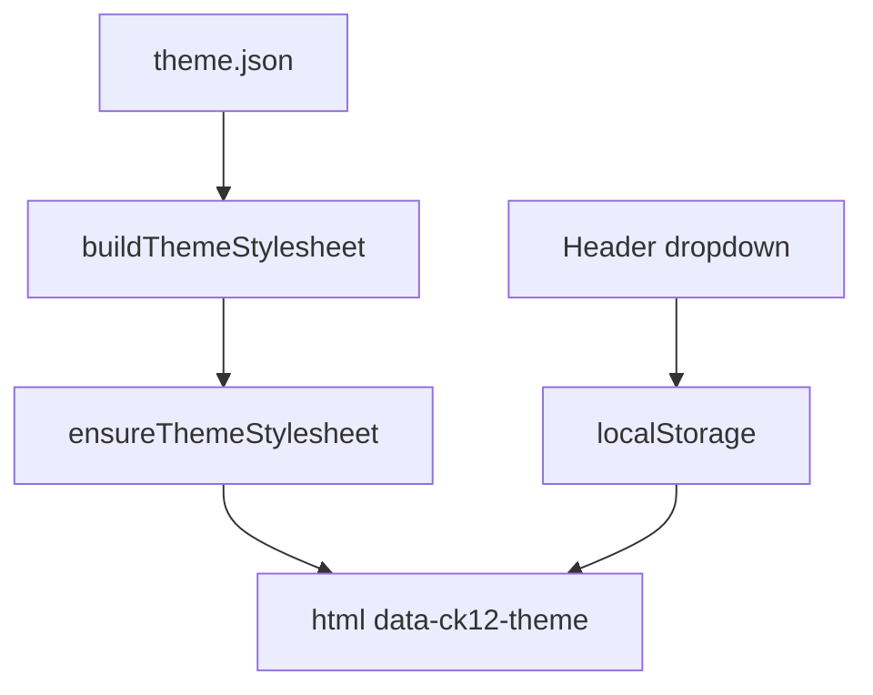
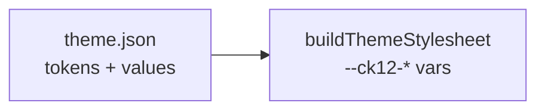
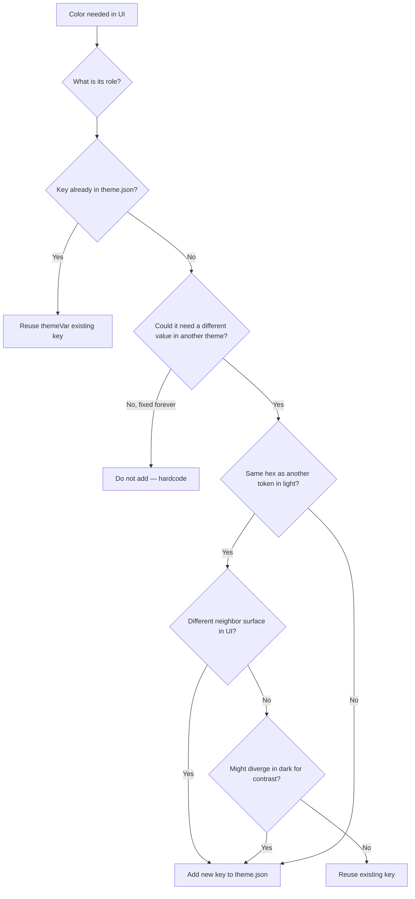

# Multi-theme colors via CSS variables

## Goal

Support multiple color themes (`light`, `dark`, `customTest`) from in-repo `[theme.json](packages/ck12-atoms/Theme/theme.json)` — the **only** source of token definitions and values.

Colors flow through **CSS custom properties** injected at runtime. Switching theme = `data-ck12-theme` on `<html>` + `localStorage`.

| Layer             | How colors are read                |
| ----------------- | ---------------------------------- |
| styled-components | `color: ${themeVar("textMuted")};` |
| SCSS / CSS        | `color: var(--ck12-text-muted);`   |

**Non-color tokens** (`fonts`, `space`, `radii`, …) stay on existing `atomTheme` / Provider — unchanged.

---

## Architecture



---

## Token system

### `theme.json` is the single source of truth

No separate registry file. Token keys and values per theme live in `theme.json`.

```json
{
  "version": 1,
  "defaultTheme": "light",
  "themes": {
    "light": {
      "surface": "#ffffff",
      "surfaceRaised": "#ffffff",
      "text": "#2f3542",
      "textMuted": "#71767e",
      "textSubtle": "#7d8189",
      "brand": "#008545",
      "brandHover": "#007e40",
      "onBrand": "#ffffff",
      "border": "#dee6f0",
      "danger": "#ff4f57",
      "scrim": "rgba(47, 53, 66, 0.45)",
      "shadow": "rgba(0, 0, 0, 0.16)"
    },
    "dark": { "...": "..." },
    "customTest": { "...": "..." }
  }
}
```

**Semantic tokens only** — role-based names (`surface`, `textMuted`, `brand`), not primitive palette names (`PRIMARY`, `SECONDARY600`). Old `[COLOR](packages/ck12-atoms/Theme/theme.js)` keys are deprecated over time.

**Reference groups** (naming guide during audit — not a separate file):

- **surface** — `surface`, `surfaceRaised`, `surfaceSunken`, `surfaceInset`, `surfaceOverlay`, `surfaceHover`, `surfaceInverse`, `scrim`
- **text** — `text`, `textSecondary`, `textMuted`, `textSubtle`, `textInverse`, `textLink`
- **border** — `border`, `borderStrong`, `borderFocus`
- **brand** — `brand`, `brandHover`, `brandStrong`, `brandSubtleWeak`, `brandSubtle`, `brandSubtleStrong`, `brandText`, `onBrand`
- **status** — `accent`, `success`, `successSubtle`, `danger`, `warning`
- **input** — `inputBg`, `inputText`, `inputPlaceholder`, `inputBorder`, `inputBorderFocus`
- **misc** — `scrollbarThumb`, `shadow`

`light` values come from CK-12 production audit. `dark` / `customTest` tuned per token.

### Two layers



| Piece                        | Responsibility                                        |
| ---------------------------- | ----------------------------------------------------- |
| `**theme.json**`             | Token keys, hex/rgba per theme, `defaultTheme`        |
| `**buildThemeStylesheet()**` | Reads JSON → emits `--ck12-{kebab}` declarations only |

### Naming rules

| Concept                       | Format                                         | Example                       |
| ----------------------------- | ---------------------------------------------- | ----------------------------- |
| Token key (JSON / `themeVar`) | camelCase, role-based                          | `textMuted`, `onBrand`        |
| CSS variable                  | `--ck12-` + kebab-case (derived automatically) | `--ck12-text-muted`           |
| `themeVar("textMuted")`       | → `var(--ck12-text-muted)`                     | styled-components             |
| Theme name                    | camelCase                                      | `light`, `dark`, `customTest` |

Token key → CSS var is **pure convention** in `theme-stylesheet.js`:

```js
const tokenToKebab = (key) => key.replace(/([A-Z])/g, "-$1").toLowerCase();
// textMuted → text-muted → --ck12-text-muted
```

---

## When to add a new token (decision framework)

Use when encountering a color in code or design. **Adding a token = adding a key to `theme.json`.**



### Rules

1. **Add by UI role, not hex.** Two usages with the same hex in light may still need separate keys.
2. **Light-mode collision is allowed** — same hex in `light`, different values in `dark` when neighbor surfaces differ.
3. **Do not collapse keys** to shrink JSON — tune contrast per role in both `light` and `dark`.
4. **Reuse** when role and neighbor context are identical across themes.
5. **Ask for clarification** when role is ambiguous.

### Worked examples (light + dark)

Each example walks the tree and shows resulting `theme.json` entries.

---

**Example 1 — Reuse existing key**

|          |                                                                       |
| -------- | --------------------------------------------------------------------- |
| **UI**   | Primary CTA button background (green in light, lighter green in dark) |
| **Role** | Main brand action color                                               |
| **Tree** | Role = brand action → `brand` already exists → **reuse**              |
| **Code** | `background: ${themeVar("brand")};`                                   |

```json
"light": { "brand": "#008545" },
"dark":  { "brand": "#3ecf8e" }
```

Same key, different values per theme. No new token.

---

**Example 2 — New key (role does not exist yet)**

|          |                                                                        |
| -------- | ---------------------------------------------------------------------- |
| **UI**   | Modal backdrop overlay (`rgba(47, 53, 66, 0.45)` in light)             |
| **Role** | Dimmed scrim behind modal — not `surface`, not `border`                |
| **Tree** | No `scrim` key yet → needs different opacity in dark → **add `scrim`** |
| **Code** | `background: ${themeVar("scrim")};`                                    |

```json
"light": { "scrim": "rgba(47, 53, 66, 0.45)" },
"dark":  { "scrim": "rgba(6, 8, 15, 0.66)" }
```

New role → new key in both themes.

---

**Example 3 — Same hex in light, split in dark (neighbor surfaces differ)**

|           |                                                                                                                                                                               |
| --------- | ----------------------------------------------------------------------------------------------------------------------------------------------------------------------------- |
| **UI**    | (a) Helper text under a form field on white page background                                                                                                                   |
|           | (b) Caption text inside a raised card                                                                                                                                         |
| **Audit** | Both use `#71767e` in light today                                                                                                                                             |
| **Tree**  | Same hex in light → **different neighbors** (`surface` vs `surfaceRaised`) → dark surfaces diverge (`#14161f` vs `#1d2030`) → need different text contrast → **add two keys** |

```json
"light": {
  "textMuted": "#71767e",
  "textSubtle": "#71767e"
},
"dark": {
  "textMuted": "#aab1c2",
  "textSubtle": "#7c8498"
}
```

| Placement                       | Token        | Why not one key                                                 |
| ------------------------------- | ------------ | --------------------------------------------------------------- |
| Form hint on `surface`          | `textMuted`  | Tuned for text on default background                            |
| Card caption on `surfaceRaised` | `textSubtle` | Raised surface in dark is lighter — caption needs a darker ramp |

**Wrong:** one `textMuted` for both — tuning dark for the card breaks the form hint (or vice versa).

---

**Example 4 — Same hex in light, reuse one key (neighbors match)**

|          |                                                                                                                   |
| -------- | ----------------------------------------------------------------------------------------------------------------- |
| **UI**   | Error icon and error inline message — both red `#ff4f57` on white                                                 |
| **Role** | Semantic error color                                                                                              |
| **Tree** | Same hex → same neighbor (`surface`) → same contrast need in dark → `**danger` already exists or add one `danger` |
| **Code** | Both use `themeVar("danger")`                                                                                     |

```json
"light": { "danger": "#ff4f57" },
"dark":  { "danger": "#ff6f76" }
```

One key — role and context are identical.

---

**Example 5 — Do not add (fixed color)**

|          |                                                                        |
| -------- | ---------------------------------------------------------------------- |
| **UI**   | Assignment banner yellow `#FED100` — marketing accent, must stay exact |
| **Tree** | Must not change in dark or WL → **hardcode**, omit from `theme.json`   |

---

**Example 6 — Migrating two similar usages that look the same in light**

|                |                                                                                                                                                                |
| -------------- | -------------------------------------------------------------------------------------------------------------------------------------------------------------- |
| **UI**         | (a) Modal header border — `#dee6f0`                                                                                                                            |
|                | (b) Input default border — `#7d8189` (SECONDARY600)                                                                                                            |
| **Temptation** | One `border` token                                                                                                                                             |
| **Tree**       | Different roles: decorative divider vs interactive control border → dark needs stronger input border for visibility → **two keys: `border` and `inputBorder`** |

```json
"light": {
  "border": "#dee6f0",
  "inputBorder": "#7d8189"
},
"dark": {
  "border": "#2a2f41",
  "inputBorder": "#414963"
}
```

---

**Example 7 — `brand` vs `textLink` in light and dark**

|           |                                                                                                                                                                          |
| --------- | ------------------------------------------------------------------------------------------------------------------------------------------------------------------------ |
| **UI**    | (a) Filled green button → `brand` / `onBrand`                                                                                                                            |
|           | (b) Inline hyperlink in paragraph → `textLink`                                                                                                                           |
| **Light** | Button `#008545`, link might also be green today                                                                                                                         |
| **Tree**  | Same hex possible in light → different roles (filled control vs inline text) → dark may want brighter link (`#a8a3f6`) without changing button brand → **separate keys** |

```json
"light": {
  "brand": "#008545",
  "onBrand": "#ffffff",
  "textLink": "#008545"
},
"dark": {
  "brand": "#3ecf8e",
  "onBrand": "#14161f",
  "textLink": "#a8a3f6"
}
```

`textLink` matches `brand` in light but diverges in dark — valid light-mode collision.

---

### Quick reference: what to check for dark mode

When evaluating a color usage, ask:

1. **What surface sits behind it?** (`surface`, `surfaceRaised`, `brand`, …)
2. **Will that surface change in `dark`?** If yes, text/border on top may need its own token.
3. **Is this interactive?** Inputs, buttons, links often need separate tokens from decorative borders/text.
4. **Can one dark value work for all current light usages?** If tuning dark for usage A breaks usage B → split tokens.

### When NOT to add to `theme.json`

- Illustration / asset colors
- One-off debug colors
- Colors that never change across themes

---

## How to add a token — scenarios

### A — Bootstrap from audit (COLOR / PALETTE → semantic)

1. Identify **UI role** per usage (`COLOR.primary` on CTA → `brand`; body → `text`)
2. Add key + `light` value to `theme.json`
3. Set `dark` / `customTest` values (may differ from other keys even if light hex matched)
4. Use `themeVar("brand")` in components

### B — Legacy CSS var in `app.css` / SCSS

1. Map usage to semantic key (`--button-base-color` on buttons → `brand`)
2. Replace in file: `var(--button-base-color)` → `var(--ck12-brand)`
3. Remove hardcoded `:root` color vars from `[app.css](packages/course-book-app/css/app.css)` once `ensureThemeStylesheet` runs on boot

### C — `PALETTE` import in component

1. Determine role → pick existing key or add new one to `theme.json`
2. `themeVar("surface")` not `themeVar("white")`

### D — Hardcoded hex

1. Identify role → match or add key in `theme.json`
2. `themeVar("token")`

### E — New semantic token

1. Pick name from group (`surfaceOverlay`, `textLink`, …)
2. Add key to **every** theme object in `theme.json` (or partial + merge fallback)
3. Use in code only after JSON updated

### F — Migrating `theme.colors.`

Map old key to semantic key (`darkText` → `text`; `primary` → `brand` context-dependent). `themeVar("text")`. Do not add old COLOR names to `theme.json`.

### G — New theme

Add key under `themes`. Full token set or partial with merge:

```js
function resolveThemeTokens(themeName) {
  const defaults = themeJson.themes[themeJson.defaultTheme];
  return { ...defaults, ...themeJson.themes[themeName] };
}
```

### H — Key missing in one theme

Merge fallback from `defaultTheme`.

### I — Fixed color

Hardcode / `PALETTE`; omit from `theme.json`.

### J — SCSS

Use `var(--ck12-text-muted)` (or matching semantic token). Migrate off old vars like `--button-base-color` as files are touched.

### K — Audit order

1. Define initial semantic keys in `theme.json` (from groups above)
2. Audit components — role per color usage
3. Migrate legacy CSS vars in SCSS / `app.css` to `var(--ck12-*)`
4. Populate `themes.light` from production
5. Tune `themes.dark` per token
6. Add `customTest` + future themes
7. `buildThemeStylesheet` + `themeVar`
8. Migrate components to `themeVar`

---

## Stylesheet generation

`[theme-stylesheet.js](packages/ck12-atoms/Theme/theme-stylesheet.js)` reads `**theme.json` only:

```js
export const themeVar = (token) => `var(--ck12-${tokenToKebab(token)})`;

export const buildThemeStylesheet = (scope = ":root") => {
  const { defaultTheme, themes } = themeJson;
  // :root { default theme tokens as --ck12-* }
  // :root[data-ck12-theme="dark"] { dark tokens }
};

export const ensureThemeStylesheet = () => {
  /* inject <style id="ck12-theme-modes"> */
};

export const applyThemeName = (name) => {
  document.documentElement.setAttribute("data-ck12-theme", name);
};

export const getThemeNames = () => Object.keys(themeJson.themes);
export const getTokenKeys = () =>
  Object.keys(themeJson.themes[themeJson.defaultTheme]);
```

Export from `[exportable.js](packages/ck12-atoms/exportable.js)`.

---

## Runtime — `ThemeModeProvider`

`[packages/ck12-universe/theme/ThemeModeProvider.jsx](packages/ck12-universe/theme/ThemeModeProvider.jsx)`:

- On mount: `ensureThemeStylesheet()` → read `localStorage.ck12ActiveTheme` → `applyThemeName()`
- `useEffect`: on change → `applyThemeName` + `localStorage.setItem`
- `useThemeMode()` → `{ activeThemeName, setActiveThemeName, themeNames }`

---

## Header dropdown (temporary)

`[ck12-header](packages/ck12-header)`: `light` / `dark` / `customTest` → `setActiveThemeName`.

---

## Atoms refactor

Replace in core atoms (Button, Input, Modal, ModalContent, Typography, …):

- `PALETTE.*` → `themeVar("semanticKey")` by role
- hardcoded hex → `themeVar("semanticKey")`
- `theme.colors.*` → semantic key → `themeVar()`

Do not change `theme.space`, `theme.fontSizes`, etc.

---

## App wiring

`[course-book-app/src/App.jsx](packages/course-book-app/src/App.jsx)`:

```jsx
<ThemeModeProvider>
  <ThemeProvider>
    <AppWithAtomsProvider />
  </ThemeProvider>
</ThemeModeProvider>
```

`ensureThemeStylesheet()` + `applyThemeName()` synchronously before first paint.

---

## Testing

- Every key in `themes.light` has a resolved value in each theme after merge
- `themeVar("textMuted")` === `"var(--ck12-text-muted)"`
- Header dropdown switches themes; migrated SCSS/atoms using `var(--ck12-*)` / `themeVar()` update

---

## Deferred

- API-driven active theme name
- Remove dummy dropdown + `customTest`
- Full migration off deprecated `COLOR` keys
- Remote `theme.json` from CDN
- WL themes (`odishaCustomTheme`) — add under `themes` with same keys, different values

---

## Risks

- Audit misses a color source → won't respond to theme switch until migrated to `themeVar()` / `var(--ck12-*)`
- `theme.colors[dynamicKey]` — validate against `getTokenKeys()`
- Flash on load — sync stylesheet + `applyThemeName` before React render
